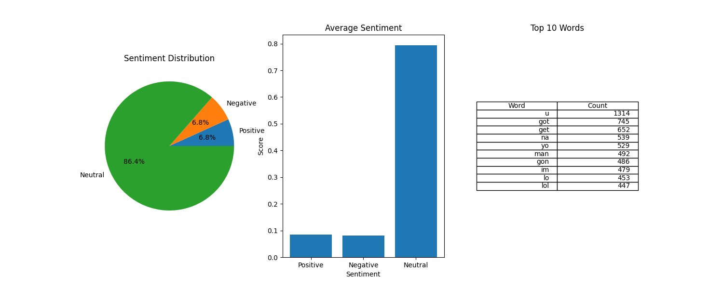

# Sentiment Analysis Project

This project analyzes sentiment from Discord messages using different Python libraries and displays visualizations. Below, I outline my thought process and approach to building this project.

---

## Disclaimer:
 - This project used my personal discord account to collect my messages from a Discord Server, Please follow the rules required by Discord and create a bot using the Discord Developer portal
 - I have used a sample messages JSON file for the files uploaded to Github as i do not want my personal messages to be on there. Please feel free to delete it or change it to your messages however you like

## **How It Works**

### **1. Retrieving Messages from Discord**

To start, I needed a way to access messages from a Discord channel. I used the Discord API to make requests and retrieve messages. This involved:

- Collecting Discord token for the channel you want to parse
- Writing a script to paginate through messages using the API.
- Filtering and storing relevant messages in a JSON file for further analysis.

### **2. Choosing Sentiment Analysis Libraries**

Initially, I experimented with Textblob as it is a simple library to use however switched to Vader as it is more accurate for Social media messages:

- **TextBlob**: A simple and beginner-friendly library for text processing.
- **VADER (Valence Aware Dictionary and sentiment Reasoner)**: Specifically designed for social media text, offering better accuracy for short, informal messages.

After testing, I decided to focus on VADER for its suitability to my discord messages.

### **3. Data Preprocessing**

The raw data contained various noise elements, such as:

- URLs
- Emojis, mentions of othe rusers
- Non-alphabetic characters

To clean the data, I:

- Tokenized the messages.
- Removed stopwords and non-alphabetic content.
- Prepared the cleaned text for analysis.

### **4. Visualizing Sentiment Analysis Results**

To make the results more interpretable, I created several visualizations using the Matplotlib library:

- **Pie Chart**: Displays the distribution of positive, negative, and neutral sentiments.
- **Bar Chart**: Shows the average sentiment scores.

- **Frequency Table**: Lists the top 10 most common words with their counts.

Each visualization helped to uncover patterns in the data, such as the overall tone of the messages and words said most.




## Results

#### From this we can gather that most of my messages are neutral in emotion/sentiment for two reasons i presume:

 1. The messages are in fact neutral and no emotions can be found in the sentence
 2. The Current Code and Sentiment libraries can't find  sentiment in the message that more accurate Sentiment Models or Artifical Intelligence could find

#### The top 10 words are mostly  words that are slang that are used in everyday sentences such as "Yo" and "u".

 #### I'm not suprised by the results of these visualzitions as this what i would think the results would be before i decided to start this project
---

## **Project Structure**

```

|-- Textblob /  # TextBlob version
|   |-- SentimentV1.py
|
|-- Vader/  # Vader version 
|   |-- charts.png
|   |-- SentimentV2.py
|   # Modularized with improved visualizations
|   |-- SentimentFinal.py
|  
|-- messages_sample.json # Placeholder JSON for testing sample messages
|
|-- .gitignore
|-- README.md
|-- 
```

---

## **Challenges and Learnings**

1. **Cleaning and processing data**:

   - Many messages contained emojis, URLs,  which required careful preprocessing.

2. **Choosing the Right Tools**:

   - Experimenting with different libraries like TextBlob and VADER highlighted the importance of domain-specific .

3. **Improving Visualizations**:

   - Building charts using matplotlib and combining them.

---

## **Future Improvements**

- Use more advanced sentiment libraries for more accurate data
- Build an interactive dashboard for real-time analysis e.g tableu, Power Bi.
- Automate the entire workflow from data collection to visualization.
